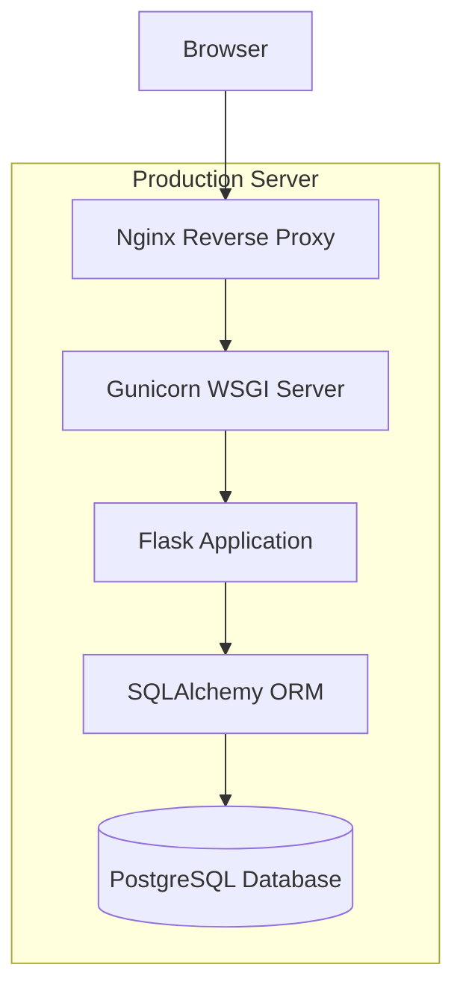
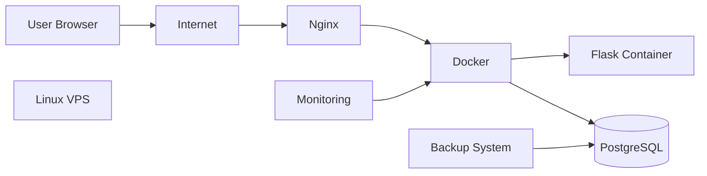
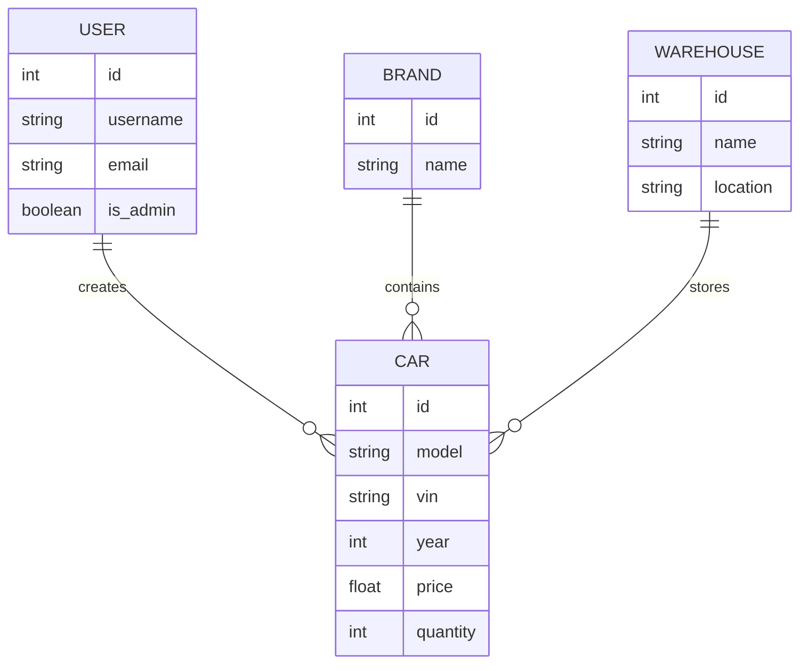
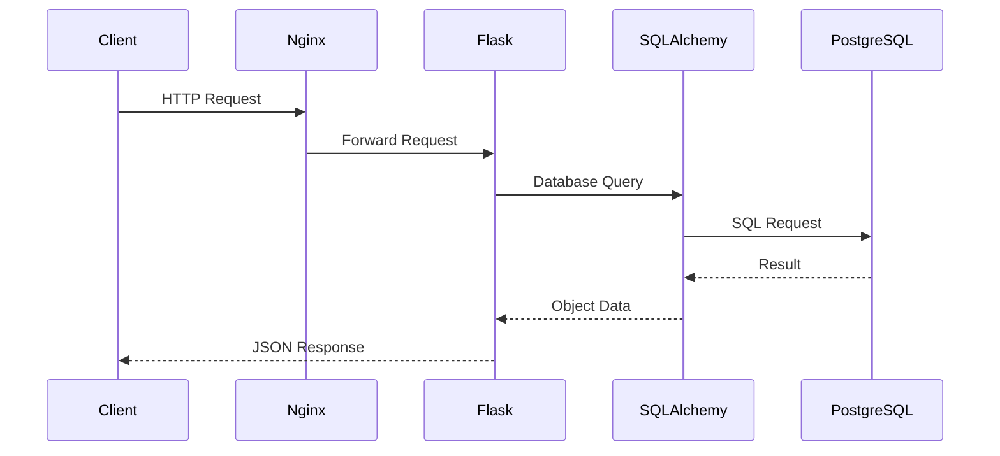
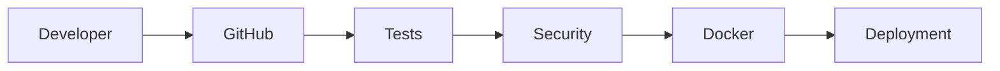
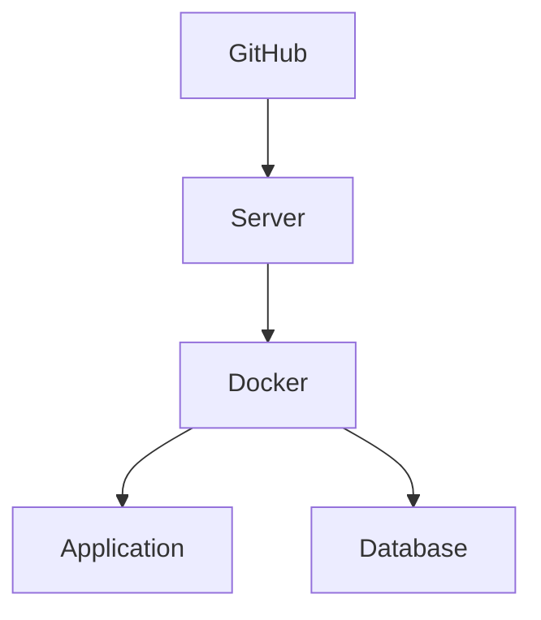

# Auto Inventory System

Vehicle inventory management system built with Flask and PostgreSQL for managing vehicles across multiple warehouses with authentication, role-based access control, analytics, and REST API.

---

# Overview

Auto Inventory System is a full-stack web application designed for centralized vehicle inventory management.

The application provides a complete workflow for storing, searching, analyzing, and managing vehicle inventory across multiple warehouses.

The system includes:

- User authentication
- Role-based authorization
- Vehicle inventory management
- Warehouse management
- Brand management
- Analytics dashboard
- REST API
- Docker deployment
- CI/CD automation
- Monitoring and backup system

The project demonstrates practical implementation of:

- Flask backend architecture
- SQLAlchemy ORM
- PostgreSQL database design
- Secure authentication
- REST API development
- Containerized deployment
- Linux VPS production environment
- Automated DevOps processes

---

# Demo

Application:

https://autolot25.ddns.net:8086


## Demo Account

| Username | Password | Access |
|----------|----------|--------|
| demo | demo123 | Read Only |

---

# Features

## Authentication

- User registration
- Login/logout system
- Secure password hashing
- Session management
- Remember Me functionality
- Role-based permissions


## Vehicle Management

- Add vehicles
- Edit vehicle information
- Delete vehicles according to permissions
- Store VIN numbers
- Assign vehicles to warehouses
- Assign vehicles to brands
- Track vehicle ownership


## Warehouse Management

- Create warehouses
- Store warehouse locations
- Track warehouse inventory
- Monitor warehouse loading


## Brand Management

- Create vehicle brands
- Remove brands
- Manage brand catalog


## Search and Filtering

- Search by vehicle model
- Search by VIN
- Search by brand
- Filter by warehouse
- Filter by production year
- Filter by price range
- Sorting
- Pagination


## Analytics

Dashboard includes:

- Total vehicle count
- Vehicle distribution by brand
- Warehouse utilization
- Production year statistics
- Most expensive vehicles
- Inventory overview


## DevOps Features

- Docker containerization
- Docker Compose deployment
- GitHub Actions CI/CD
- Automatic deployment
- Health monitoring
- Auto recovery
- PostgreSQL backups
- Telegram notifications

---

# User Roles

The system implements Role-Based Access Control (RBAC).

| Feature | Demo | User | Admin |
|---------|:----:|:----:|:-----:|
| View vehicles | ✅ | ✅ | ✅ |
| Search and filtering | ✅ | ✅ | ✅ |
| View statistics | ✅ | ✅ | ✅ |
| Add vehicles | ❌ | ✅ | ✅ |
| Delete own vehicles | ❌ | ✅ | ✅ |
| Delete any vehicle | ❌ | ❌ | ✅ |
| Edit vehicles | ❌ | ❌ | ✅ |
| Manage brands | ❌ | ❌ | ✅ |
| Manage warehouses | ❌ | ❌ | ✅ |
| Administration panel | ❌ | ❌ | ✅ |


The first registered user automatically receives administrator privileges.

---

# Technology Stack

| Component | Technology |
|-----------|------------|
| Backend | Python 3.10 |
| Framework | Flask |
| ORM | SQLAlchemy |
| Database | PostgreSQL |
| Frontend | HTML5, CSS3, Bootstrap 5, JavaScript |
| Authentication | Flask-Login |
| Security | Werkzeug |
| WSGI Server | Gunicorn |
| Reverse Proxy | Nginx |
| Containerization | Docker |
| Orchestration | Docker Compose |
| CI/CD | GitHub Actions |
| Monitoring | Bash Scripts, Cron |
| Notifications | Telegram Bot API |

---

# Architecture



---

# Deployment Architecture



---

# Project Structure

```text
auto-inventory/

├── app/
│   ├── models/
│   │   ├── user.py
│   │   ├── car.py
│   │   ├── brand.py
│   │   └── warehouse.py
│   │
│   ├── routes/
│   │   ├── auth.py
│   │   ├── cars.py
│   │   ├── brands.py
│   │   ├── warehouses.py
│   │   └── stats.py
│   │
│   ├── services/
│   │
│   ├── templates/
│   │
│   └── static/
│
├── config/
│   ├── .env.example
│   ├── .env.docker
│   └── config.py
│
├── deploy/
│   ├── auto-deploy.sh
│   └── deploy.sh
│
├── monitoring/
│   ├── health_check.sh
│   ├── auto_heal.sh
│   └── webhook_server.py
│
├── tests/
│
├── Dockerfile
├── docker-compose-dev.yml
├── docker-compose.prod.yml
├── requirements.txt
├── Makefile
├── run.py
└── README.md
```

---

# Getting Started

## Clone Repository

```bash
git clone https://github.com/Evgen242/auto-inventory.git

cd auto-inventory
```

---

# Automatic Deployment

The project provides an automated deployment script for Ubuntu servers.

```bash
curl -fsSL https://raw.githubusercontent.com/Evgen242/auto-inventory/main/deploy/auto-deploy.sh | bash
```

The script performs:

- Docker installation
- Docker Compose installation
- Repository cloning
- Environment configuration
- Container build
- Application startup

---

# Run with Docker

Create environment configuration:

```bash
cp config/.env.example config/.env.docker
```

Build and start containers:

```bash
docker compose -f docker-compose-dev.yml up -d --build
```

Check containers:

```bash
docker compose -f docker-compose-dev.yml ps
```

View logs:

```bash
docker compose -f docker-compose-dev.yml logs -f
```

Stop application:

```bash
docker compose -f docker-compose-dev.yml down
```

---

# Local Development

Create virtual environment:

```bash
python3 -m venv venv
```

Activate:

Linux/macOS:

```bash
source venv/bin/activate
```

Windows:

```cmd
venv\Scripts\activate
```

Install dependencies:

```bash
pip install -r requirements.txt
```

Configure environment:

```bash
cp config/.env.example .env
```

Run application:

```bash
python run.py
```

---

# Docker Commands

## Rebuild Application

```bash
docker compose -f docker-compose-dev.yml up -d --build
```

---

## Check Containers

```bash
docker compose -f docker-compose-dev.yml ps
```

---

## Application Logs

```bash
docker compose -f docker-compose-dev.yml logs -f app-dev
```

---

## Enter Container

```bash
docker exec -it auto_inventory_app_dev bash
```

---

## Remove Containers and Volumes

```bash
docker compose -f docker-compose-dev.yml down -v
```

---

# Configuration

The application uses environment variables for configuration.

Example:

```bash
cp config/.env.example .env
```

Docker environment:

```bash
cp config/.env.example config/.env.docker
```

Configuration includes:

- Database connection
- Security settings
- Session configuration
- Telegram notifications
- Application parameters

---

# Environment Variables

| Variable | Description | Required |
|----------|-------------|----------|
| `SECRET_KEY` | Flask application secret key | Yes |
| `DATABASE_URL` | PostgreSQL connection string | Yes |
| `SESSION_TIMEOUT` | User session lifetime | No |
| `TELEGRAM_BOT_TOKEN` | Telegram bot token | No |
| `TELEGRAM_CHAT_ID` | Telegram notification chat | No |

---

# Database

The application uses PostgreSQL as the main database.

Main entities:



---

# REST API

The application provides REST endpoints for integration with external systems.

---

## Authentication API

### Login

```
POST /auth/login
```

Example:

```bash
curl -X POST http://localhost:5000/auth/login \
-d "username=admin" \
-d "password=password123"
```

---

### Registration

```
POST /auth/register
```

---

# Vehicle API

## Get Vehicles

```
GET /api/cars
```

Access:

```
Authenticated users
```

---

## Create Vehicle

```
POST /api/cars
```

Access:

```
User, Admin
```

Example:

```json
{
  "model": "Toyota Camry",
  "year": 2024,
  "vin": "JT123456789",
  "price": 35000,
  "brand_id": 1,
  "warehouse_id": 1
}
```

---

## Delete Vehicle

```
DELETE /api/cars/{id}
```

Permissions:

- User → own vehicles only
- Admin → all vehicles

---

# Brand API

## Get Brands

```
GET /api/brands
```

---

## Create Brand

```
POST /api/brands
```

Access:

```
Admin only
```

---

# Warehouse API

## Get Warehouses

```
GET /api/warehouses
```

---

## Create Warehouse

```
POST /api/warehouses
```

Access:

```
Admin only
```

---

# Statistics API

```
GET /api/stats
```

Returns:

- Total vehicles
- Brand statistics
- Warehouse utilization
- Price analytics
- Production year distribution

---

# Current User API

```
GET /api/me
```

Returns authenticated user information.

Example response:

```json
{
  "username": "admin",
  "email": "admin@example.com",
  "is_admin": true
}
```

---

# API Request Flow



---

# Monitoring

The project includes monitoring and automatic recovery tools.

Features:

- Service health checks
- Automatic restart
- Cron integration
- Error notifications
- Container monitoring

---

## Health Check

```bash
./monitoring/health_check.sh
```

---

## Auto Recovery

```bash
./monitoring/auto_heal.sh
```

Example cron configuration:

```bash
*/5 * * * * /var/www/apps/auto-inventory/monitoring/auto_heal.sh
```

---

# Backup System

The backup system automatically creates:

- PostgreSQL database backups
- Docker volume backups
- Configuration backups

Schedule:

```
Daily at 02:00
```

Retention:

```
30 days
```

Manual execution:

```bash
./backup.sh
```

Backup logs:

```
/var/backups/auto-inventory/backup.log
```

---

# Telegram Notifications

Optional Telegram integration provides operational alerts.

Notifications:

- Administrator login
- New user registration
- Daily statistics
- Server problems
- Automatic recovery events


Required configuration:

```env
TELEGRAM_BOT_TOKEN=your_token
TELEGRAM_CHAT_ID=your_chat_id
```

---

# CI/CD Pipeline

The project uses GitHub Actions for automation.

Pipeline:



---

## Workflows

| Workflow | Purpose |
|----------|---------|
| check.yml | Code quality checks |
| test.yml | Automated testing |
| dockerhub.yml | Docker image build and publish |

---

# Security

Implemented security features:

- Password hashing with Werkzeug
- Session-based authentication
- Role-based authorization
- Environment-based secrets
- HTTPS support through Nginx
- Protected administrative operations

---

# Testing

The project includes automated tests.

Available commands:

Run all tests:

```bash
make test-all
```

Unit tests:

```bash
make test-unit
```

Coverage:

```bash
make coverage
```

---

# Validation

Validated components:

| Component | Status |
|-----------|--------|
| Authentication | ✅ |
| Authorization | ✅ |
| Vehicle CRUD | ✅ |
| Warehouse CRUD | ✅ |
| Brand CRUD | ✅ |
| Search | ✅ |
| Filtering | ✅ |
| Pagination | ✅ |
| REST API | ✅ |
| PostgreSQL | ✅ |
| Docker | ✅ |
| CI/CD | ✅ |
| Monitoring | ✅ |
| Backup | ✅ |

---

# Deployment

Production deployment includes:

- Linux VPS
- Docker Compose
- Gunicorn
- Nginx Reverse Proxy
- PostgreSQL
- SSL certificates
- Monitoring
- Backup automation

Deployment workflow:



---

# Future Improvements

Planned improvements:

- Swagger / OpenAPI documentation
- Advanced audit logging
- Email notifications
- Two-factor authentication
- Redis caching
- Excel import/export
- Vehicle image management
- VIN decoder integration
- Mobile application
- Kubernetes deployment
- Advanced analytics

---

# License

MIT License

---

# Author

**Evgenii Fralou**

GitHub:

https://github.com/Evgen242


If this project is useful, consider giving it a star on GitHub.
