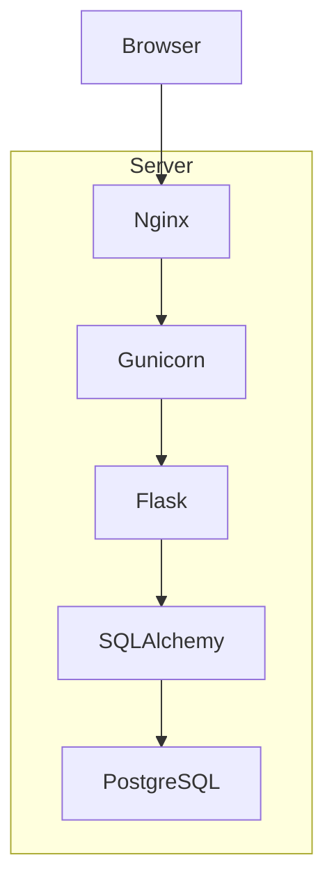
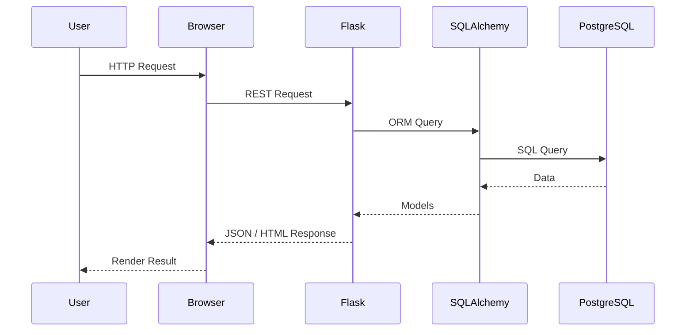

# Auto Inventory System

Inventory management system built with Flask and PostgreSQL for managing vehicles across multiple warehouses with authentication, role-based access control, analytics, and REST API.

---

## Overview

Auto Inventory System is a full-stack web application designed for centralized vehicle inventory management.

The application provides authentication, warehouse management, vehicle registration, analytics dashboards, and role-based authorization. It supports both local development and production deployment using Docker, PostgreSQL, Gunicorn, and Nginx.

The project demonstrates practical implementation of:

- Flask web framework
- SQLAlchemy ORM
- PostgreSQL database
- Authentication and authorization
- REST API architecture
- Warehouse management
- Inventory analytics
- Docker containerization
- GitHub Actions CI/CD
- Linux VPS deployment
- Monitoring and automated backup

---

## Demo

**Application**

https://autolot25.ddns.net:8086

### Demo Account

| Username | Password | Access |
|----------|----------|--------|
| demo | demo123 | Read Only |

---

## Features

### Authentication

- User registration
- Secure authentication
- Session management
- Remember Me functionality
- Role-based authorization

### Vehicle Management

- Vehicle registration
- VIN management
- Warehouse assignment
- Brand management
- Inventory updates
- Ownership tracking

### Warehouse Management

- Multiple warehouse support
- Warehouse occupancy monitoring
- Vehicle allocation

### Search & Filtering

- Search by model
- Search by VIN
- Search by brand
- Filter by warehouse
- Filter by production year
- Filter by price
- Pagination
- Sorting

### Analytics

- Dashboard
- Vehicle statistics
- Warehouse utilization
- Brand distribution
- Most expensive vehicles
- Production year distribution

### Administration

- User management
- Brand management
- Warehouse management
- Vehicle editing
- Full administrative access

### DevOps

- Docker support
- Docker Compose
- GitHub Actions
- Automated deployment
- Health monitoring
- Backup system
- Telegram notifications

---

## Technology Stack

| Component | Technology |
|------------|------------|
| Backend | Python 3.10 |
| Framework | Flask |
| ORM | SQLAlchemy |
| Database | PostgreSQL |
| Frontend | HTML5, CSS3, Bootstrap 5, JavaScript |
| Authentication | Flask-Login |
| Password Hashing | Werkzeug |
| WSGI Server | Gunicorn |
| Reverse Proxy | Nginx |
| Containerization | Docker |
| Orchestration | Docker Compose |
| CI/CD | GitHub Actions |
| Monitoring | Bash Scripts, Cron |
| Notifications | Telegram Bot API |

---

## Architecture



---

## Project Structure

```text
auto-inventory/

├── app/
│   ├── models/
│   ├── routes/
│   ├── services/
│   ├── templates/
│   ├── static/
│   └── __init__.py
│
├── config/
│   ├── .env.example
│   ├── .env.docker
│   └── config.py
│
├── deploy/
│   ├── auto-deploy.sh
│   └── deploy.sh
│
├── monitoring/
│   ├── health_check.sh
│   ├── auto_heal.sh
│   └── webhook_server.py
│
├── tests/
│
├── Dockerfile
├── docker-compose-dev.yml
├── docker-compose.prod.yml
├── requirements.txt
├── Makefile
├── run.py
└── README.md
```

---

# Getting Started

## Clone Repository

```bash
git clone https://github.com/Evgen242/auto-inventory.git

cd auto-inventory
```

---

## Automatic Deployment

The project includes an automated installation script for Ubuntu servers.

```bash
curl -fsSL https://raw.githubusercontent.com/Evgen242/auto-inventory/main/deploy/auto-deploy.sh | bash
```

The script automatically:

- Installs Docker
- Installs Docker Compose
- Clones the repository
- Configures the environment
- Builds Docker images
- Starts all services

---

## Run with Docker

Copy the environment template.

```bash
cp config/.env.example config/.env.docker
```

Build and start the application.

```bash
docker compose -f docker-compose-dev.yml up -d --build
```

Verify running containers.

```bash
docker compose -f docker-compose-dev.yml ps
```

View logs.

```bash
docker compose -f docker-compose-dev.yml logs -f
```

Stop the application.

```bash
docker compose -f docker-compose-dev.yml down
```

---

## Run Locally

Create a virtual environment.

```bash
python3 -m venv venv
```

Activate the environment.

Linux/macOS

```bash
source venv/bin/activate
```

Windows

```cmd
venv\Scripts\activate
```

Install dependencies.

```bash
pip install -r requirements.txt
```

Copy environment configuration.

```bash
cp config/.env.example .env
```

Run the application.

```bash
python run.py
```

---

## Docker Commands

Rebuild containers.

```bash
docker compose -f docker-compose-dev.yml up -d --build
```

View running containers.

```bash
docker compose -f docker-compose-dev.yml ps
```

Application logs.

```bash
docker compose -f docker-compose-dev.yml logs -f app-dev
```

Enter application container.

```bash
docker exec -it auto_inventory_app_dev bash
```

Remove containers and volumes.

```bash
docker compose -f docker-compose-dev.yml down -v
```

---

## Configuration

The application uses environment variables for configuration.

Create a local configuration file.

```bash
cp config/.env.example .env
```

For Docker deployment.

```bash
cp config/.env.example config/.env.docker
```
---

# User Roles

The application implements role-based access control (RBAC).

| Feature | Demo | User | Admin |
|----------|:----:|:----:|:-----:|
| View vehicles | ✅ | ✅ | ✅ |
| Search and filtering | ✅ | ✅ | ✅ |
| Dashboard | ✅ | ✅ | ✅ |
| Create vehicles | ❌ | ✅ | ✅ |
| Delete own vehicles | ❌ | ✅ | ✅ |
| Delete any vehicle | ❌ | ❌ | ✅ |
| Edit vehicles | ❌ | ❌ | ✅ |
| Manage brands | ❌ | ❌ | ✅ |
| Manage warehouses | ❌ | ❌ | ✅ |
| Administration | ❌ | ❌ | ✅ |

The first registered user automatically receives administrator privileges.

---

# Authentication

The application uses Flask-Login for session-based authentication.

Features include:

- User registration
- Login / Logout
- Secure password hashing
- Session timeout
- Remember Me functionality
- Cookie-based authentication
- Role-based authorization

---

# REST API

## Authentication

### Login

```
POST /auth/login
```

### Register

```
POST /auth/register
```

---

## Vehicles

### Get Vehicles

```
GET /api/cars
```

### Create Vehicle

```
POST /api/cars
```

### Delete Vehicle

```
DELETE /api/cars/{id}
```

---

## Brands

### Get Brands

```
GET /api/brands
```

### Create Brand

```
POST /api/brands
```

---

## Warehouses

### Get Warehouses

```
GET /api/warehouses
```

### Create Warehouse

```
POST /api/warehouses
```

---

## Statistics

```
GET /api/stats
```

---

## Current User

```
GET /api/me
```

---

# Example API Request

```bash
curl -c cookies.txt \
-X POST http://localhost:5000/auth/login \
-d "username=admin" \
-d "password=password123"
```

Retrieve vehicles.

```bash
curl -b cookies.txt \
http://localhost:5000/api/cars
```

Retrieve statistics.

```bash
curl -b cookies.txt \
http://localhost:5000/api/stats
```

---

# Request Processing Flow



---

# Monitoring

The application includes built-in monitoring scripts for production environments.

Available features:

- Health checks
- Automatic service recovery
- Cron integration
- Log monitoring
- Telegram notifications

Run health check.

```bash
./monitoring/health_check.sh
```

Automatic recovery.

```bash
./monitoring/auto_heal.sh
```

---

# Backup

Daily backup includes:

- PostgreSQL database
- Docker volumes
- Configuration files

Manual backup.

```bash
./backup.sh
```

Backup retention:

- Daily backups
- Automatic cleanup after 30 days

---

# Telegram Notifications

Optional Telegram integration provides notifications for:

- Administrator login
- New user registration
- Daily statistics
- Server failures
- Automatic recovery

Required environment variables:

```text
TELEGRAM_BOT_TOKEN=
TELEGRAM_CHAT_ID=
```

---

# CI/CD

GitHub Actions automatically performs:

| Workflow | Description |
|-----------|-------------|
| Code Quality | Linting and formatting |
| Security Check | Secret scanning |
| Docker Build | Docker image creation |
| Docker Publish | Push image to Docker Hub |

---

# Environment Variables

| Variable | Description | Required |
|----------|-------------|----------|
| SECRET_KEY | Flask secret key | Yes |
| DATABASE_URL | PostgreSQL connection string | Yes |
| SESSION_TIMEOUT | Session timeout | No |
| TELEGRAM_BOT_TOKEN | Telegram bot token | No |
| TELEGRAM_CHAT_ID | Telegram chat ID | No |

---

# Development

Run all tests.

```bash
make test-all
```

Unit tests.

```bash
make test-unit
```

Coverage.

```bash
make coverage
```

Clean project.

```bash
make clean
```

Run formatting checks.

```bash
make pre-commit
```

---

# Validation

The application has been validated using automated and manual testing.

| Metric | Result |
|----------|--------|
| Authentication | ✅ |
| Authorization | ✅ |
| Vehicle CRUD | ✅ |
| Warehouse CRUD | ✅ |
| Brand CRUD | ✅ |
| Search | ✅ |
| Filtering | ✅ |
| Dashboard | ✅ |
| REST API | ✅ |
| Docker Deployment | ✅ |
| PostgreSQL | ✅ |
| CI/CD | ✅ |

---

# Deployment

Production deployment includes:

- Docker Compose
- Gunicorn
- Nginx
- PostgreSQL
- Automatic deployment
- Monitoring
- Backup
- SSL support

---

# Project Requirements

| Requirement | Status |
|--------------|--------|
| Authentication | ✅ |
| Role-based authorization | ✅ |
| Vehicle management | ✅ |
| Warehouse management | ✅ |
| Brand management | ✅ |
| Dashboard | ✅ |
| REST API | ✅ |
| PostgreSQL | ✅ |
| Docker | ✅ |
| GitHub Actions | ✅ |
| Monitoring | ✅ |
| Backup | ✅ |

---

# Future Improvements

Planned enhancements include:

- OpenAPI / Swagger documentation
- Two-factor authentication (2FA)
- Email notifications
- Audit logging
- Import/Export to Excel
- VIN decoding service
- Vehicle image uploads
- Redis caching
- WebSocket notifications
- Kubernetes deployment
- Unit and integration testing

---

# License

This project is licensed under the **MIT License**.

---

# Author

**Evgenii Fralou**

GitHub:

https://github.com/Evgen242

---

If you find this project useful, consider giving it a ⭐ on GitHub.
